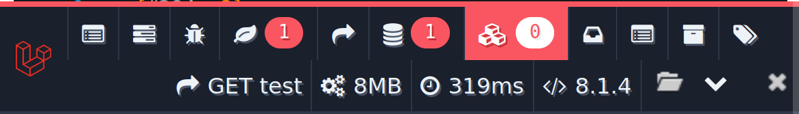
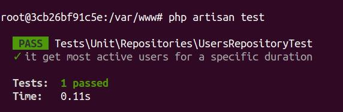

## Watchcrunch challenge
## Implemented features
* [x] Get the users with the number of posts and the title of the last post, who have created more than 10 posts in the last 7 days.
* [x] Create schedule command to check the weekly active users.
* [x] Write unit tests for the most active users query


<br/>


## Used technologies
- PHP 7.4
- Laravel 8
- PHPUnit
- Docker

## Installation Steps

> prerequisite: PHP > 7.4

* Clone repository
* `composer install`
* Create DB eg: `watchcrunch`
* `composer setup` (copies `env` file, generates key, and migrates DB)
* Configure your phpunit.xml file
* Then run ``` php artisan test ```
